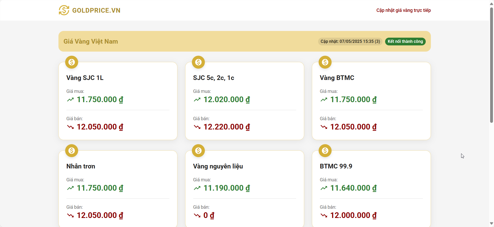
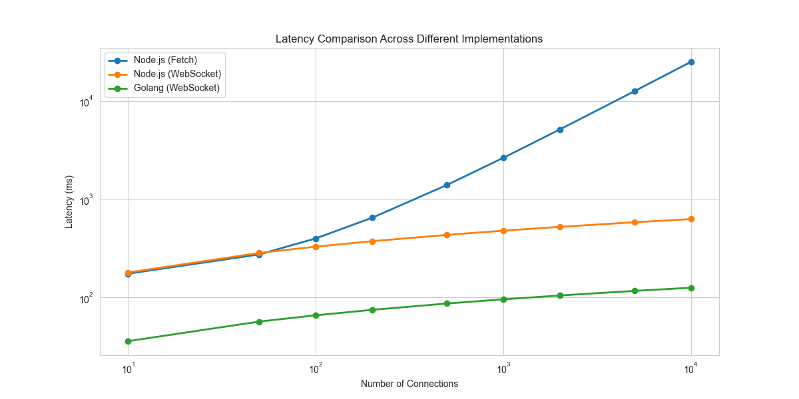
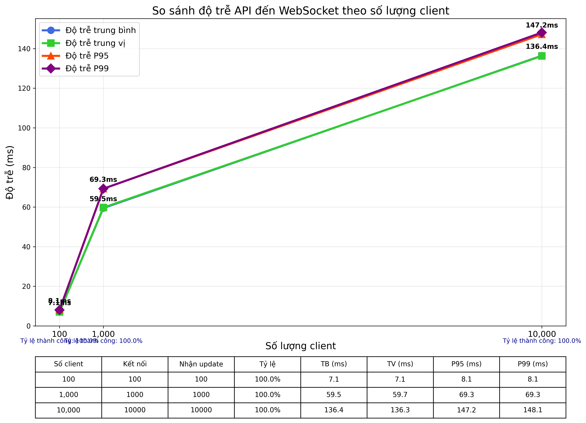

# Kiến Trúc Phần Mềm - CS4
## Ứng dụng theo dõi giá vàng thời gian thực.
Cập nhật giá vàng từ NHNN, Bảo TÍN MINH CHÂU


### Phân tích
- Giá vàng thường ít thay đổi trong thời gian ngắn
- Chỉ cập nhật database khi có thay đổi
- Tối ưu hóa khả năng kết nối đồng thời nhiều thiết bị, đảm bảo cập nhật thời gian thực và sử dụng hiệu quả tài nguyên hệ thống.

Hình ảnh hệ thống   
 

Đã giải quyết: 
- Triển khai WebSocket protocol để thay thế polling. Thay vì client gửi HTTP request mỗi 2 giây, server hiện push updates đến các client đã kết nối thông qua emit events chỉ khi data thay đổi, giảm đáng kể network traffic và server load.

- **Cache-Aside Pattern**: Triển khai pattern này để tối ưu hóa việc truy xuất dữ liệu
  ```
  1. Khi client yêu cầu dữ liệu:
     - Đầu tiên kiểm tra trong Redis cache
     - Nếu có (cache hit), trả về dữ liệu ngay lập tức
     - Nếu không có (cache miss), truy vấn từ SQLite
     - Sau khi lấy từ DB, cập nhật lại Redis cache với TTL 24 giờ
     
  2. Khi cập nhật dữ liệu:
     - Dữ liệu mới được publish qua Redis channel
     - Cache được cập nhật tự động
     - Database được cập nhật thông qua subscriber riêng biệt
  ```
  
- **Cấu trúc cache đa tầng**: 
  - Memory cache (trong ứng dụng Golang): Lưu trữ tức thời, truy xuất nhanh nhất
  - Redis cache: Lưu trữ phân tán, chia sẻ giữa các instance
  - SQLite DB: Lưu trữ lâu dài, nguồn dữ liệu chính thức

- **Phân tích trường hợp cụ thể**: Thời gian phản hồi đã giảm từ ~300ms xuống còn ~5ms khi truy vấn dữ liệu đã được cache, giảm tải database khi có nhiều client kết nối đồng thời.


### 2. Yêu cầu thời gian thực
- Ban đầu hệ thống cần 2s để có thể nhận giá vàng mới 
Giải quyết:- 
**Redis Pub/Sub**: Triển khai hệ thống publish/subscribe với Redis để phân phối cập nhật hiệu quả
- **Kênh phân tách**: Sử dụng hai kênh sub:
  - `goldprices:updates`: Phân phối cập nhật đến tất cả WebSocket clients
  - `gold-prices-db`: Chỉ dành cho cập nhật database, giảm tải cho DB
- **Mutil instance**: Cho phép nhiều server instance cùng xử lý và phân phối cập nhật

## API Documentation

| Endpoint | Phương thức | Mô tả | Dữ liệu phản hồi |
|----------|-------------|-------|------------------|
| `/api/add` | POST | Thêm hoặc cập nhật giá vàng | `{"success": true, "message": "...", "data": [...]}` |
| `/api/get/:id` | GET | Lấy giá vàng theo ID hoặc type |  |
| `/api/gold-prices` | GET | Lấy tất cả giá vàng hiện tại |  |
| `/ws` | WebSocket | Kết nối WebSocket real-time |  |
| `/socket.io/*` | Socket.IO | Kết nối Socket.IO (tương thích) |  |

### Cấu trúc đối tượng Gold Price

```json
{
  "id": "1",
  "type": "gold_1",
  "name": "VÀNG MIẾNG VRTL",
  "karat": "24k",
  "purity": "999.9",
  "buy_price": 11750000,
  "sell_price": 12050000,
  "updated_at": "2023-05-07 15:35:00"
}
```

**Lưu ý**: 
- ID và type đều có thể dùng để truy vấn giá vàng cụ thể
- Dữ liệu được cache trên Redis và lưu trữ trong database
- Cập nhật sẽ được tự động gửi đến tất cả clients thông qua WebSocket


-----

## Các Vấn Đề Chất Lượng Của Hệ Thống Gốc

Hệ thống ban đầu gặp nhiều hạn chế về hiệu suất, bảo mật, và khả năng mở rộng:

### 1. Hiệu Suất
- **Fetch liên tục**: Hệ thống gửi yêu cầu mỗi 2 giây, gây quá tải khi có nhiều kết nối
- **Thiếu cache**: Mỗi lần truy vấn đều phải gọi trực tiếp đến SQLite, làm tăng thời gian phản hồi

**Đã giải quyết:** 
- Triển khai WebSocket protocol để thay thế polling. Thay vì client gửi HTTP request mỗi 2 giây, server hiện push updates đến các client đã kết nối thông qua emit events chỉ khi data thay đổi, giảm đáng kể network traffic và server load.

- Triển khai Cache-Aside:
    1. Khi client yêu cầu dữ liệu:
     - Đầu tiên kiểm tra trong Redis cache
     - Nếu có (cache hit), trả về dữ liệu ngay lập tức
     - Nếu không có (cache miss), truy vấn từ SQLite
     
    2. Khi cập nhật dữ liệu:
     - Dữ liệu mới được publish qua Redis channel
     - Cache được cập nhật tự động
     - Database được cập nhật thông qua subscriber riêng biệt

### 2. Yêu cầu thời gian thực

- Ban đầu hệ thống cần 2s để có thể nhận giá vàng mới 
**Giải quyết:**

**Redis Pub/Sub**: Triển khai hệ thống publish/subscribe với Redis để phân phối cập nhật hiệu quả
- **Kênh phân tách**: Sử dụng hai kênh sub:
  - `goldprices:updates`: Phân phối cập nhật đến tất cả WebSocket clients
  - `gold-prices-db`: Chỉ dành cho cập nhật database, giảm tải cho DB
- **Mutil instance**: Cho phép nhiều server instance cùng xử lý và phân phối cập nhật

### 3. Giải quyết vấn đề quá nhiều người dùng

Khi hệ thống Node.js phải xử lý quá nhiều người dùng đồng thời, thì gặp phải vấn đề nghiêm trọng về blocking event-loop. Một kết nối bị treo có thể làm ảnh hưởng đến toàn bộ server do kiến trúc của Node.js. Để giải quyết vấn đề này, nhóm đã phát triển phiên bản server bằng Golang, tận dụng các ưu điểm:

- Mỗi WebSocket connection được xử lý trong goroutine riêng và có cơ chế tự hủy nếu có lỗi.
- Sử dụng goroutines và channels để tận dụng tối đa concurrent processing
- Xử lý lỗi và graceful shutdown đảm bảo tính ổn định của hệ thống

### So sánh hiệu năng
Phương thức đo khởi tạo nhiều kết nối và đo thời gian từ lúc /add cho đến khi toàn bộ ws nhận được dữ liệu

1. Ban đầu
   


2.server-nodejs


